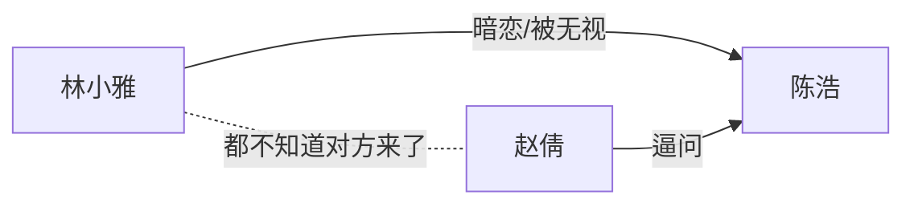

# 素材台账与角色关系

台账是跨帧一致性的唯一真相。人物到第五帧还像不像第一帧，看的是台账写得准不准，不是记忆。

## 身份 / 变体 / 瞬态

拆素材只问一句：**换掉它，还是不是同一个？**

| 类别 | 判据 | 归哪 | 例子 |
|---|---|---|---|
| 身份 | 换一个就不是同一个人/地/物 | 新素材 | 陈浩 → 陈浩的哥哥 |
| 变体 | 还是同一个，外观变了 | 同素材记状态 | 换校服、额头见血、雨后湿透、礼盒拆封 |
| 瞬态 | 这一镜才成立 | 归分镜，不进台账 | 抬左手、侧头、站画面右侧、俯拍 |

**服装、伤势、湿污、开合、光态基本都是变体，不是新身份。** 一换衣服就新开一个素材，参考图会散成一堆互相不像的人。

含混指代不猜。原文只写"那个女生"，就在台账里标未决，问用户，不要自己安一个人。

## 识别锚点

锚点必须**可见、可生成、可比对**。

| 不是锚点 | 是锚点 |
|---|---|
| 气质忧郁 | 左眉尾一道浅疤，眼下青黑 |
| 很有钱 | 定制藏青三件套，左腕金表 |
| 破旧的教室 | 后墙掉漆露红砖，第三排课桌缺一角 |
| 精致的礼盒 | 粉红缎带方形礼盒，掌宽，缎带打十字结 |
| 高质量、电影感 | （这是风格词，写进项目卡，不是锚点） |

一个素材 3-5 条锚点够用。写满十条，模型反而抓不住重点。

人物额外记**声线**：`少年音偏清亮，句尾发虚`。即梦按 `角色-声线绑定` 吃这条，跨帧不写就会换声。

## 台账格式

```markdown
## 陈浩
- 锚点: 19 岁男大学生，短寸黑发，左眉尾一道浅疤，洗旧藏青连帽衫
- 声线: 少年音偏清亮，句尾发虚
- 参考图: 参考图/人物/陈浩.png
- 本片状态: 宿醉未醒，眼下青黑
- 变体: 校服版（第 4 帧起换回校服）
```

一级标题是文件名（`# 人物台账`），二级标题是素材名。**二级标题就是即梦里 @ 的那个词**——校验器按它核对 @引用，写错一个字就 FAIL。

场景多记一条**光态**（时段 + 天气 + 光向）：白天正午顶光和黄昏侧逆光是两个场景，别共用一个素材。

物品记**状态链**：`未拆封 → 被塞回 → 掉地`。哪一帧到哪个状态，写在帧文件里。

## 角色关系

关系不是人物小传，是**这一集会被打破的那条线**。写关系表时每行都要落到可见后果。

| 甲 | 乙 | 关系 | 甲的诉求 | 乙的挡法 | 可见后果 |
|---|---|---|---|---|---|
| 林小雅 | 陈浩 | 同班暗恋 | 想被看见 | 装听不见 | 递礼盒被无视，手停在半空 |
| 赵倩 | 陈浩 | 直脾气好友 | 逼他表态 | 沉默摸口袋 | 当众逼问，围观者侧目 |

**可见后果那一列是分镜的输入。** 填不出来说明这条关系这一集用不上，删掉。

人物超过 5 个必画 mermaid 图：



## 信息差

单列一节：**谁知道什么，谁不知道**。信息差决定谁的反应先给特写、谁的台词是明说谁是试探。

这一集会打破的关系写在最后，它就是这一集的落点。
